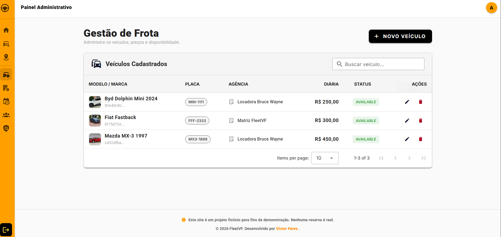
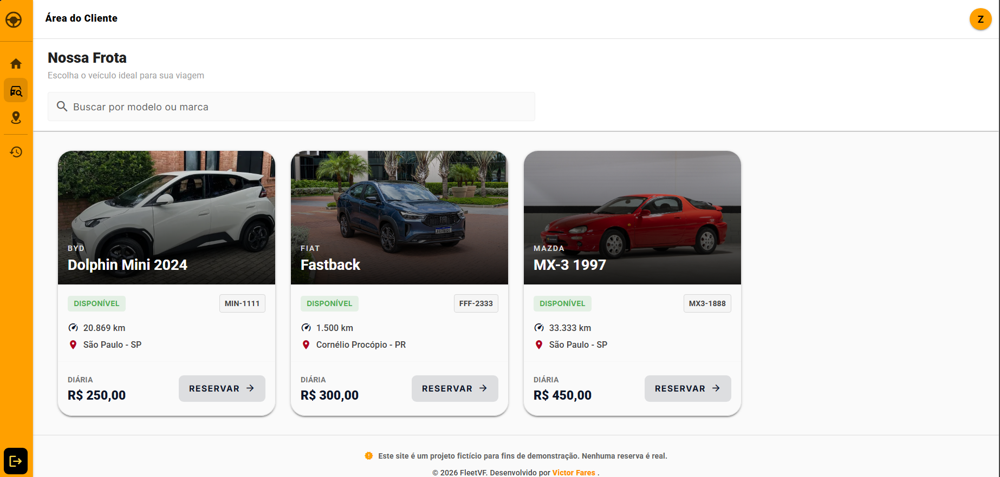
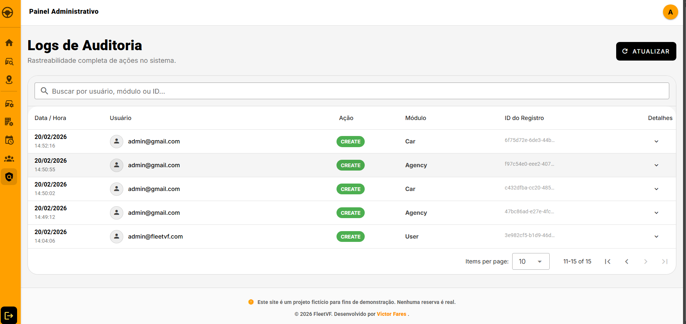
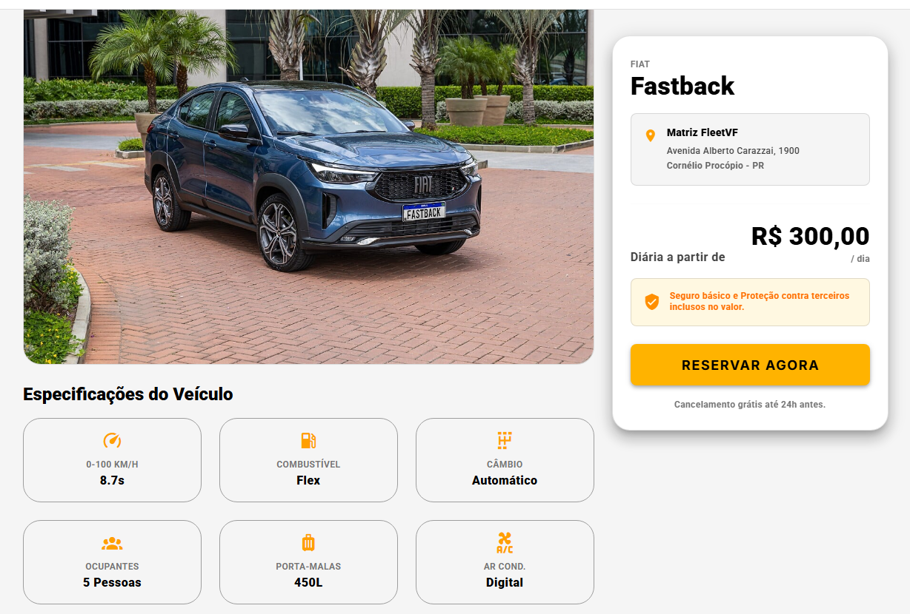
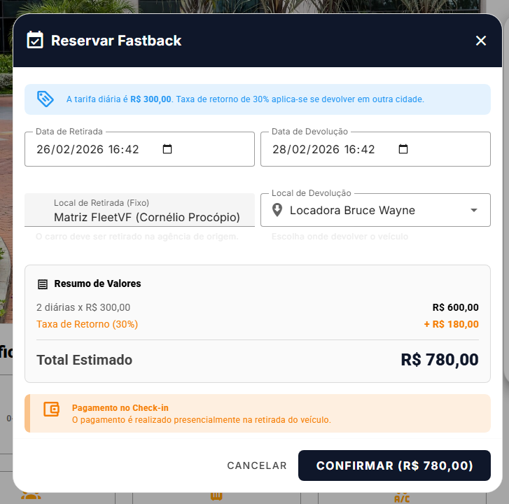

# 🚗 FleetVF - Sistema Premium de Locação de Veículos


O **FleetVF** é uma plataforma *Full-Stack* completa para gestão de locadoras de veículos. Projetada com uma arquitetura moderna e escalável, a aplicação atende tanto aos clientes finais (busca e reserva de veículos) quanto aos administradores da frota (gestão de agências, auditoria, controle de frota e devoluções).

## 🔗 Live Demo (Produção)
* **Frontend (Aplicação Web):** [https://fleet-vf.vercel.app](https://fleet-vf.vercel.app)
* **Backend (API Swagger):** [https://fleetvf.onrender.com/api](https://fleetvf.onrender.com/api)

---

## ✨ Funcionalidades Principais

A aplicação possui controle de acesso baseado em funções (RBAC - Role Based Access Control), dividindo a experiência em duas interfaces:

### 👤 Visão do Cliente (Usuário)
* **Vitrine de Veículos:** Catálogo completo com busca e filtros.
* **Reserva Dinâmica:** Cálculo de preços em tempo real com base nas datas selecionadas.
* **Taxa de Retorno (One-Way Fee):** Cálculo automático de taxa extra caso o veículo seja devolvido em uma agência diferente da retirada.
* **Meus Aluguéis:** Painel do usuário para visualizar o histórico e o status das suas reservas.

### 🛡️ Visão do Administrador (Backoffice)
* **Gestão de Frota (Cars):** Cadastro de veículos, upload de imagens, controle de quilometragem e atualização de status (Disponível, Alugado, Manutenção).
* **Gestão de Agências (Agencies):** Administração dos pontos físicos de retirada e devolução.
* **Gestão de Locações (Rentals):** Painel para aprovar reservas, realizar **Check-in** (retirada) e finalizar locações com atualização automática de quilometragem.
* **Trilha de Auditoria (Audit Logs):** Sistema de rastreamento de ações críticas (quem fez o quê e quando).
* **Gestão de Usuários:** Controle completo sobre as contas da plataforma.

---

## 🛠️ Tecnologias e Arquitetura

O projeto foi construído utilizando um **monorepo lógico**, separando Frontend e Backend, mas mantendo a tipagem estrita com **TypeScript** em ambas as pontas.

### Frontend (Cliente UI)
* **Framework:** Vue 3 (Composition API) + Vite.
* **UI/UX:** Vuetify 3 (Componentes Material Design responsivos e padronizados sem uso de CSS customizado excessivo).
* **Gerenciamento de Estado:** Pinia.
* **Requisições:** Axios com Interceptors para injeção automática de tokens JWT.
* **Roteamento:** Vue Router com *Navigation Guards* para proteção de rotas privadas e administrativas.

### Backend (API RESTful)
* **Framework:** NestJS.
* **Arquitetura:** Orientada a Módulos (Domain-Driven Design simplificado). Módulos isolados para `auth`, `users`, `cars`, `agencies`, `rentals` e `audit`.
* **Banco de Dados:** PostgreSQL hospedado na nuvem (Neon Database).
* **ORM:** TypeORM.
* **Segurança e Estabilidade:** * Autenticação via **JWT (JSON Web Tokens)** com validação estrita de `Issuer` (Backend) e `Audience` (Frontend) contra ataques de reuso.
  * Proteção global de rotas via `JwtAuthGuard` e `RolesGuard`.
  * Validação rigorosa de dados (DTOs) com `class-validator` e `class-transformer` (bloqueio de payloads não mapeados - `forbidNonWhitelisted`).
  * **Rate Limiting (Throttler)** nativo para mitigação de ataques DDoS e força bruta.
  * CORS configurado estritamente para os domínios da Vercel.

---

## 📂 Estrutura do Projeto

A arquitetura de pastas reflete a separação de responsabilidades (SoC) e boas práticas de Domain-Driven Design (DDD) simplificado:

```text
fleetvf/
├── frontend/                 # Aplicação Vue.js (Vite)
│   ├── src/
│   │   ├── assets/           # Arquivos estáticos (Imagens, logos, ícones)
│   │   ├── components/       # Componentes visuais reutilizáveis (Vuetify)
│   │   ├── composables/      # Lógica de negócio isolada e reutilizável (Vue Hooks)
│   │   ├── layouts/          # Estruturas base de página (ex: Menus, Sidebars, Footer)
│   │   ├── plugins/          # Configuração e inicialização de bibliotecas externas (ex: Vuetify)
│   │   ├── router/           # Configuração de rotas e Navigation Guards
│   │   ├── services/         # Configuração do Axios e interceptors de API
│   │   ├── stores/           # Gerenciamento de estado global (Pinia)
│   │   ├── styles/           # Estilos globais e variáveis de CSS/SCSS
│   │   ├── types/            # Interfaces de tipagem estrita para o TypeScript
│   │   ├── views/            # Páginas da aplicação mapeadas nas rotas
│   │   ├── App.vue           # Componente raiz que envolve toda a interface
│   │   ├── main.ts           # Ponto de entrada principal e inicialização do Vue
│   │   └── *.d.ts            # Arquivos de tipagem gerados automaticamente
│
└── backend/                  # API RESTful (NestJS)
    ├── src/
    │   ├── app/              # Módulo raiz da aplicação e controladores base
    │   ├── auth/             # Módulo de Autenticação e Autorização
    │   │   ├── config/       # Configurações do JWT
    │   │   ├── guards/       # Proteção de rotas (JwtAuthGuard, RolesGuard)
    │   │   ├── hashing/      # Serviço de criptografia de senhas (Bcrypt)
    │   │   └── strategies/   # Estratégias de validação (JWT Strategy)
    │   ├── common/           # Recursos globais e compartilhados
    │   │   ├── decorators/   # Decorators customizados (ex: @CurrentUser, @Roles)
    │   │   ├── dto/          # Objetos de transferência de dados genéricos (ex: Paginação)
    │   │   ├── filters/      # Filtros de exceção globais (Tratamento de Erros)
    │   │   └── interceptors/ # Interceptors (Interceptação e mutação de respostas)
    │   ├── modules/          # Core de Negócios (Domínios isolados)
    │   │   ├── agencies/     # Gestão de pontos físicos de locação
    │   │   ├── audit/        # Trilha de auditoria e logs de sistema
    │   │   ├── cars/         # Gestão de frota de veículos
    │   │   ├── rentals/      # Processamento de reservas e check-ins
    │   │   └── users/        # Gestão de usuários e permissões RBAC
    │   └── main.ts           # Ponto de entrada (Bootstrap), CORS, Pipes e Swagger
```

## ⚙️ Variáveis de Ambiente Configurada (DevOps)

O projeto foi desenhado para ser "Cloud Native". A infraestrutura gerencia a comunicação através das seguintes variáveis em produção:

**Backend (Render):**
* `DATABASE_URL`: Conexão com o PostgreSQL Neon (com SSL).
* `FRONTEND_URL`: Domínio da Vercel para liberação de CORS.
* `JWT_TOKEN_ISSUER` e `JWT_TOKEN_AUDIENCE`: Assinaturas digitais de validação de origem e destino dos tokens.

**Frontend (Vercel):**
* `VITE_API_URL`: URL de comunicação direta com o servidor do Render injetada em tempo de *build*.

---

## 📸 Telas e Documentação

### Documentação da API (Swagger OpenAPI)
A API do backend é totalmente autodescritiva. Acesse [https://fleetvf.onrender.com/api](https://fleetvf.onrender.com/api) para visualizar os *endpoints*, *schemas* exigidos e testar as requisições em tempo real.

<details>
  <summary><b>Clique aqui para ver capturas de tela do sistema</b></summary>
  <br>
  
  *(Insira aqui os links das imagens do seu GitHub, ex:)*
  
  > **Dashboard Administrativo - Gestão de Frota**
  > <br>
  > 
  
  > **Vitrine de Veículos - Visão do Cliente**
  > <br>
  > 
  
> **Trilha de Auditoria (Logs de Sistema)**
  > <br>
  > 

  > **Detalhes do Veículo (Página Expandida)**
  > <br>
  > 

  > **Menu de Fazer Reserva (Cálculo Dinâmico e Checkout)**
  > <br>
  > 
</details>

---
*Desenvolvido com foco em boas práticas de engenharia de software, Clean Code e segurança.*